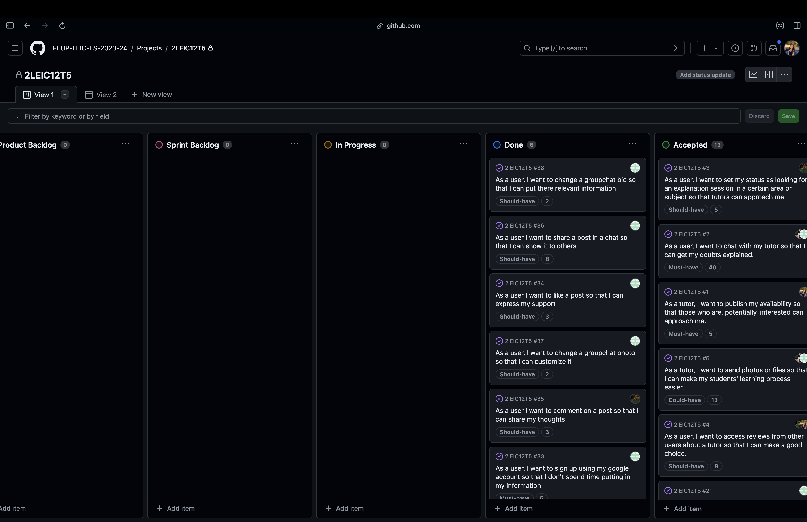

# BrainShare Development Report

Welcome to the documentation pages of the BrainShare!

You can find here details about the BrainShare, from a high-level vision to low-level implementation decisions, a kind of Software Development Report, organized by type of activities:

* [Business Modelling](#business-modelling)
    * [Product Vision](#product-vision)
    * [Features and Assumptions](#features-and-assumptions)
* [Requirements](#requirements)
    * [Domain model](#domain-model)
* [Architecture and Design](#architecture-and-design)
    * [Logical architecture](#logical-architecture)
    * [Physical architecture](#physical-architecture)
    * [Vertical prototype](#vertical-prototype)
* [UI Mockups](#mockups)
* [Sprint 1](#sprint-1)
* [Sprint 2](#sprint-2)

  
Contributions are expected to be made exclusively by the initial team, but we may open them to the community, after the course, in all areas and topics: requirements, technologies, development, experimentation, testing, etc.

Please contact us!

Thank you!

- [Beatriz Sonnemberg(up202206098)](https://github.com/BSonnemberg)
- [Gonçalo Marques(up202206205)](https://github.com/goncalocmarques)
- [Miguel Duarte(up202206102)](https://github.com/tommyvercetti10)
- [Nuno Rios(up202206272)](https://github.com/nunorioss)

---

## Business Modelling

### Product Vision

The BrainShare app is not an ordinary learning platform. It’s an educational community that by recognising that every student has unique experiences and different expertise, leverages all of this to build a unique learning environment where doubts get clarified quickly and easily.
By enabling users to have real-time connection, it ensures that everyone can get the needed expertise when they need it. Whether it’s a simple math problem or an extremely specific problem, BrainShare empowers students with a never seen access to quality information and explanations.

### Features and Assumptions
### Filter sessions
- Students can filter explanation sessions by their area or subject of interest.

### Evaluate tutors
- Students can evaluate their tutors so that others can make a wise choice.

### Chat
- A chat where students can connect with tutors so that they can schedule an explanation session.

### Ranking
- Tutors can check their position in a weekly ranking based on how much effort they have put into it.

## Requirements

### Domain model

In our app, **users** are differentiated into roles such as **tutor**, **student**, and **moderator**, each with different permissions and roles. Regardless of their role, every **user** can participate in multiple **sessions**. Additionally, **users** are able to **comment** on these **sessions**, so each **comment** is always associated with a **user** and a specific **session**. Each **session** can be associated with multiple **categories**, enabling **users** to filter **sessions** according to their interests, which makes their experience much more enjoyable and straightforward.

 

  

## Architecture and Design

### Logical architecture
The diagram represents the logical view of the BrainShare App. At the top is the App UI, through which users interact with the application. Right below it, the business logic is divided into three core models: the chat business model, the feed business model, and the authentication business model. These models are responsible for processing and satisfying user requests and delivering a good experience. Data related to user preferences is stored locally using MySQL, while Firebase serves as the server-side storage. Firebase is used to store essential data that needs to be readily accessible, such as authentication credentials, saved posts, messages, and profiles.

### Physical architecture
The diagram represents the physical architecture of the BrainShare App. Firstly, we have the user's smartphone, which is connected to the Firebase Server Machine. The Firebase Server machine has a UI, i.e., allows us to manipulate data in order to satisfy user's requests. It also enables us with an authentication service, which manages the sign-in and sign-up processes. The business logic is also specified, which has all the logic governing the app features and rules. It uses a database in which crucial data for the app features is stored, such as data about users, posts, messages, etc...

 

### Vertical prototype
In our Vertical Prototype we tried to explore Flutter and Firebase. The first step was to implement the sign-in, sign-up and sign-out features. We also explored the firebase database, and we made a small feed, where you can upload a post and see posts from other users. The process behind this prototype (all the knowledge acquired along the way) was particularly useful as it gave us all the tools needed to turn our idea into reality. 
See more [here](https://github.com/FEUP-LEIC-ES-2023-24/2lEIC12T5/tree/v0.1.0-alpha)

## Mockups

  

For the individual mockups click [here](./assets/mockups)

## Sprint #1

### Project Board

 

  
    Before Sprint #1

 

  
    After Sprint #1

### Sprint Restropective

During the first sprint, new features were added to our app. Considering the various user stories, our first step was to implement the user authentication so that the user could create their account with the desired attributes (photo, status, username, etc…). The users can now interact with each other using the chat (that allows users to send text messages, files or images) also through posts, allowing users to share their availability. Additionally, each user can access other users' profiles and leave ratings. 
The most difficult part was the ‘kickoff’, because almost every feature needed the authentication service. On a user's profile page, one can view that user's posts and the comments and ratings from other users. Now that the foundation is in place, we can refine our app and implement the remaining features. Overall, we met the expectations and we are happy with the result, even though there is still much to be improved.

### List of user stories finished

* [As a user, I want to set my status as looking for an explanation session in a certain area or subject so that tutors can approach me.](https://github.com/orgs/FEUP-LEIC-ES-2023-24/projects/45?pane=issue&itemId=56489151)
* [As a tutor, I want to publish my availability so that those who are, potentially, interested can approach me.](https://github.com/orgs/FEUP-LEIC-ES-2023-24/projects/45/views/1?pane=issue&itemId=56489460)
* [As a user, I want to chat with my tutor so that I can get my doubts explained.](https://github.com/orgs/FEUP-LEIC-ES-2023-24/projects/45/views/1?pane=issue&itemId=56488424)
* [As a user, I want to access reviews from other users about a tutor so that I can make a good choice.](https://github.com/orgs/FEUP-LEIC-ES-2023-24/projects/45/views/1?pane=issue&itemId=56489216)
* [As a tutor, I want to send photos or files so that I can make my students' learning process easier.](https://github.com/orgs/FEUP-LEIC-ES-2023-24/projects/45/views/1?pane=issue&itemId=56489427)

## Sprint #2

### Project Board

 

  
  
    Before Sprint #2

   
   
    After Sprint #2

### Sprint Restropective

Throughout this sprint, we were able to implement the features that were still on the product backlog. 
We were missing an upload of a CV for each user, so now it is possible to do it in the profile page. Furthermore, it is possible to add a bio so a user can be more precise about himself.
Every moderator can now timeout or even ban a user due to inappropriate behaviour.
The major features implemented in this sprint are now visible on the Home Screen. There are multiple filters over explanation sessions, area or subjects, explanation threads and even in chat messages. Every comment/review about other user now has to be related to an unique area. Still on the Home Screen every user has access to the ranking that shows the best tutors in the app based on its reviews and comment ratings.
The most difficult part of this sprint was the implementation of some widget and integration tests. 
We are happy with the work developed during this sprint and we already have some details to improve in the next sprint.

### List of user stories finished

* [As a tutor, I want to consult how I am doing compared to other tutors in the ranking so that I can use it to be a more appealing choice](https://github.com/orgs/FEUP-LEIC-ES-2023-24/projects/45/views/1?pane=issue&itemId=56489479)
* [As a user, I want to like a thread in the subject chat so that other users will more likely see it.](https://github.com/orgs/FEUP-LEIC-ES-2023-24/projects/45/views/1?pane=issue&itemId=56489388)
* [As a tutor, I want to add something into an explanation thread so that it will be more complete and useful.](https://github.com/orgs/FEUP-LEIC-ES-2023-24/projects/45/views/1?pane=issue&itemId=56489406)
* [As a tutor/user, I want to upload my CV and/or have a good bio so that I can showcase my skills.](https://github.com/orgs/FEUP-LEIC-ES-2023-24/projects/45/views/1?pane=issue&itemId=56489520)
* [As a moderator, I want to filter explanation threads so that it avoids redundancy or explanations lacking in quality.](https://github.com/orgs/FEUP-LEIC-ES-2023-24/projects/45/views/1?pane=issue&itemId=56489532)
* [As a user, I want to filter messages in chats so that I can find message threads I am interested in.](https://github.com/orgs/FEUP-LEIC-ES-2023-24/projects/45/views/1?pane=issue&itemId=56489367)
* [As a user, I want to filter explanation sessions by area or subject so that I can find it more easily.](https://github.com/orgs/FEUP-LEIC-ES-2023-24/projects/45/views/1?pane=issue&itemId=56489048)
* [As a moderator, I want to timeout a user or even ban him due to inappropriate behaviour.](https://github.com/orgs/FEUP-LEIC-ES-2023-24/projects/45/views/1?pane=issue&itemId=56489546)

## Sprint #3

### Project Board

 

  
    Before Sprint #3

   
    After Sprint #3

### Sprint Restropective

This final sprint was probably the one where we most accurately estimated the amount of time required for each task. As a result, the work was done in a more structured way. We were also able to improve some minor issues, which altogether made the app better. Taking all the work developed into account, we are proud of the developed app, but at the same time, we admit there are still many improvements that can be made. It was particularly nice to develop our idea from scratch, learn new technologies, and new software development techniques.

### List of user stories finished

* [As a user, I want to change a groupchat bio so that I can put there relevant information.](https://github.com/orgs/FEUP-LEIC-ES-2023-24/projects/45/views/1?pane=issue&itemId=61868685)
* [As a user I want to share a post in a chat so that I can show it to others.](https://github.com/orgs/FEUP-LEIC-ES-2023-24/projects/45/views/1?pane=issue&itemId=61868524)
* [As a user I want to like a post so that I can express my support.](https://github.com/orgs/FEUP-LEIC-ES-2023-24/projects/45/views/1?pane=issue&itemId=61868483)
* [As a user, I want to change a groupchat photo so that I can customize it.](https://github.com/orgs/FEUP-LEIC-ES-2023-24/projects/45/views/1?pane=issue&itemId=61868660)
* [As a user I want to comment on a post so that I can share my thoughts.](https://github.com/orgs/FEUP-LEIC-ES-2023-24/projects/45/views/1?pane=issue&itemId=61868496)
* [As a user, I want to sign up using my google account so that I don't spend time putting in my informatio.](https://github.com/orgs/FEUP-LEIC-ES-2023-24/projects/45/views/1?pane=issue&itemId=62009262)
